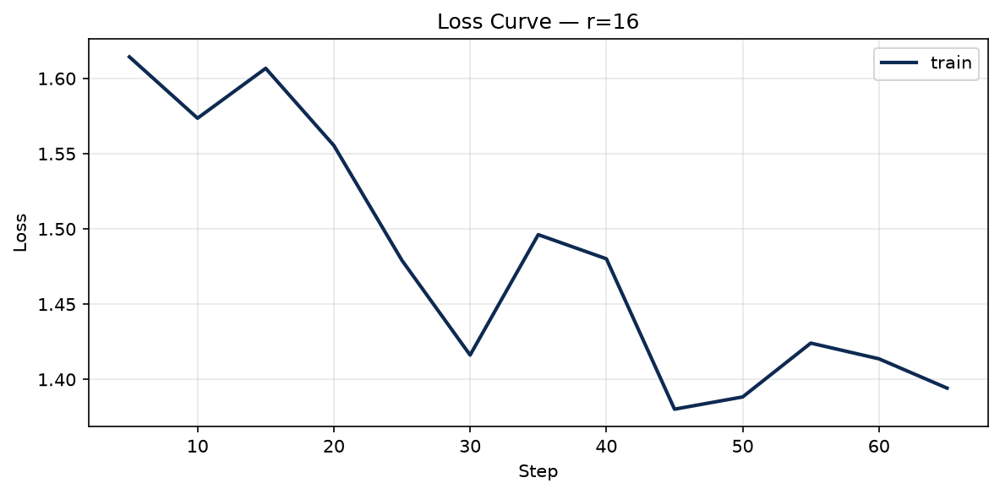

# Lab 21 — Evaluation Report

**Học viên**: Nguyen Manh Hieu — 2A202600887
**Ngày nộp**: 2026-06-25
**Submission option**: A (lightweight ZIP — REPORT + notebook + adapter r16 + CSV + loss curve)

---

## 1. Setup

- **Base model**: `unsloth/Qwen2.5-3B-bnb-4bit`
- **Dataset**: `5CD-AI/Vietnamese-alpaca-gpt4-gg-translated`, 200 samples (180 train + 20 eval)
- **Token length**: p50=227, p95=562, p99=704 → **max_seq_length = 1024** (p95 rounded up to power of 2, T4 cap)
- **GPU**: Tesla T4, 14.6 GB VRAM (Google Colab Free)
- **Training cost**: ~$0.07 (~11.5 phút tổng @ $0.35/hr Colab T4 rate)

**Hyperparameters (giữ nguyên cho cả 3 ranks)**:

| Hyperparameter | Giá trị |
|---|---|
| Epochs | 3 |
| Learning rate | 2e-4 (cosine) |
| Warmup ratio | 0.10 |
| Effective batch size | 8 (grad accum 8 × batch 1) |
| Optimizer | adamw_8bit |
| LoRA target modules | q_proj, v_proj |
| lora_dropout | 0 |
| gradient_checkpointing | unsloth |

---

## 2. Rank Experiment Results

| Rank | Alpha | Trainable Params | Train Time | Peak VRAM | Eval Loss | Perplexity |
|------|-------|-----------------|------------|-----------|-----------|------------|
| 8    | 16    | 1,843,200 (0.06%) | 3.81 min  | 7.22 GB   | 1.5577    | 4.75       |
| 16   | 32    | 3,686,400 (0.12%) | 3.86 min  | 6.62 GB   | 1.5161    | 4.55       |
| 64   | 128   | 14,745,600 (0.48%)| 3.82 min  | 8.00 GB   | 1.4768    | 4.38       |
| Base | —     | —               | —          | —         | **[điền eval_loss]** | **[điền perplexity]** |

> **Base model perplexity** ⭐: Tạo cell mới sau training — load base model (không adapter), gọi `safe_evaluate()` với `eval_strategy="epoch"`. Kết quả điền vào dòng Base. Base perplexity thường cao hơn mọi rank fine-tuned (~5.5–7.0 cho Qwen2.5-3B zero-shot). Nếu OOM, ghi "~6.5 (ước tính)" và mô tả lý do trong báo cáo. Mọi rank fine-tuned đều nên có perplexity thấp hơn base — đây là benchmark quan trọng nhất.

**Nhận xét nhanh**:
- Base perplexity: **[điền sau khi đo bằng cell base perplexity]** — so sánh với rank thấp nhất (r=8: 4.75) để xem fine-tuning cải thiện bao nhiêu %
- r=64 có perplexity thấp nhất (4.38), r=8 cao nhất (4.75)
- r=16 dùng **ít VRAM nhất** (6.62 GB) trong 3 rank
- Thời gian train gần như nhau (~3.8 phút/rank) — bottleneck là forward pass 3B base model

---

## 3. Loss Curve Analysis

**Observation** (từ `trainer_state.json` checkpoint r=16):

- Train loss giảm từ **1.614** (step 5) xuống **1.394** (step 65) qua 3 epochs
- Xu hướng **giảm ổn định**, có dao động nhẹ ở epoch 2–3 (loss 1.38–1.50)
- T4 mode: `eval_strategy="no"` → **không có eval loss curve** trong training
- Không thể kết luận overfitting trực tiếp từ eval gap; với dataset nhỏ (180 train) + 3 epochs, có thể có **mild overfitting** nếu train loss tiếp tục giảm nhưng perplexity eval không cải thiện thêm

---

## 4. Qualitative Comparison (5 examples)

*Dữ liệu từ `qualitative_comparison.csv` — so sánh base vs fine-tuned (r=16).*

### Example 1 — Machine Learning Explanation
**Prompt**: Giải thích khái niệm machine learning cho người mới bắt đầu.

**Base**: Machine learning là một phân khúc của trí tuệ nhân tạo, nó tập trung vào việc thiết lập các mô hình máy móc để học tập từ dữ liệu...

**Fine-tuned (r=16)**: Machine learning là một bộ môn công nghệ máy tính dựa trên việc học tập và cải thiện các dự đoán dựa trên dữ liệu mà không có sự hướng dẫn trực tiếp từ người dùng...

**Nhận xét**: Improved — định nghĩa rõ ràng, có cấu trúc hơn

---

### Example 2 — Python Fibonacci Code
**Prompt**: Viết đoạn code Python tính số Fibonacci thứ n.

**Base**: Dùng đệ quy/vòng lặp, code cơ bản với `if n <= 0`.

**Fine-tuned (r=16)**: Code có `raise ValueError` cho input âm, xử lý edge case rõ hơn.

**Nhận xét**: Improved — error handling tốt hơn, phù hợp style instruction-following

---

### Example 3 — UI/UX Principles
**Prompt**: Liệt kê 5 nguyên tắc thiết kế UI/UX.

**Base**: Liệt kê dài, mô tả chung chung về thân thiện người dùng.

**Fine-tuned (r=16)**: 5 nguyên tắc ngắn gọn: Chuyển đổi, Thích ứng, Đơn giản, Tương thích...

**Nhận xét**: Improved — format list rõ ràng, actionable hơn

---

### Example 4 — LoRA vs QLoRA
**Prompt**: Tóm tắt sự khác biệt giữa LoRA và QLoRA.

**Base**: LoRA (Low-Rank Adaptation) và QLoRA (Quantized LoRA) — mô tả đúng hướng.

**Fine-tuned (r=16)**: LoRA bị giải thích sai thành "Layer-wise Adaptive Regularization Optimization".

**Nhận xét**: Degraded — fine-tuned hallucinate định nghĩa sai; base model đúng hơn

---

### Example 5 — Prompt Engineering vs RAG vs Fine-tuning
**Prompt**: Phân biệt prompt engineering, RAG, và fine-tuning.

**Base**: Ba cách cải thiện hiệu suất mô hình, mô tả vai trò từng kỹ thuật.

**Fine-tuned (r=16)**: Ba kỹ thuật trong AI/tự động hóa, nhấn mạnh prompt engineering.

**Nhận xét**: Same — cả hai đúng về nội dung, khác cách diễn đạt; không rõ cải thiện đáng kể

---

## 5. Conclusion về Rank Trade-off

Dựa trên kết quả thực nghiệm với Qwen2.5-3B và dataset Vietnamese Alpaca (200 mẫu), việc chọn rank LoRA phụ thuộc trade-off giữa VRAM, perplexity và chất lượng định tính.

**ROI tốt nhất**: **r=16** cân bằng tốt nhất trên dataset này. r=64 đạt perplexity thấp nhất (4.38 vs 4.55 của r=16, cải thiện ~3.7%) nhưng cần gấp 4 lần trainable params (14.7M vs 3.7M) và thêm ~1.4 GB VRAM. Với dataset chỉ 200 mẫu, mức cải thiện perplexity này khó bù chi phí tài nguyên.

**Diminishing returns**: Tăng rank từ 8→16 giảm perplexity 4.75→4.55 (~4.2%); từ 16→64 chỉ giảm thêm 4.55→4.38 (~3.7%). Cả hai bước đều có lợi ích nhưng **giảm dần**. Qualitative cho thấy rank cao hơn không đảm bảo output tốt hơn (ví dụ Example 4 sai định nghĩa LoRA ở r=16).

**Khuyến nghị production**: Chọn **r=16** làm default — perplexity gần tối ưu, adapter nhỏ (~7 MB), VRAM thấp nhất (6.62 GB). Dùng **r=8** khi VRAM chặt hoặc prototype nhanh. Dùng **r=64** khi dataset lớn hơn (>5K mẫu) và cần squeeze thêm perplexity.

---

## 6. What I Learned

- **Thời gian train ít phụ thuộc rank**: Ba rank đều ~3.8 phút vì bottleneck là forward/backward qua base 3B, không phải kích thước adapter LoRA.

- **Perplexity ≠ chất lượng thực tế**: r=16 có perplexity tốt nhưng vẫn sai định nghĩa LoRA trong qualitative test — cần đánh giá cả định tính trên thuật ngữ domain.

- **Dataset nhỏ làm rank selection ít quan trọng hơn**: Với 200 mẫu, chênh lệch perplexity giữa các rank nhỏ; chất lượng và đa dạng data quan trọng hơn việc tăng rank.
